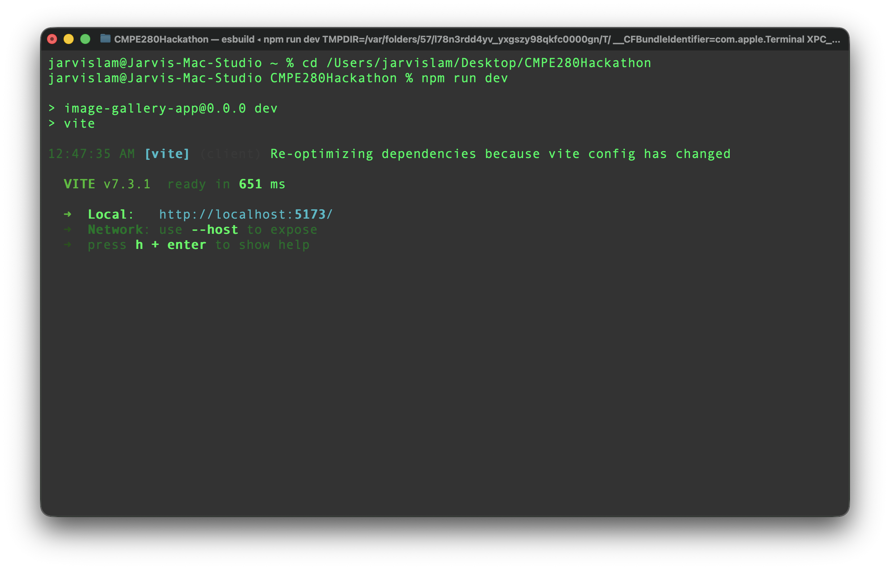

# CMPE 280 Hackathon
Midterm, Hackathon, Final Project Team 2 - group 7
Members:
1. Dat Tri Tat
2. Hei Lam
3. Henry Yang
4. Saim Sheikh
5. LuuThuy Luu

## Problem and idea
## Key technical choices
## How to run the project
1. Go to the project folder
   ```bash
   cd CMPE280Hackathon
   ```

2. Run the app
   ```bash
   npm run dev
   ```

3. Open the browser and go to the localhost
   e.g.
   ```bash
   http://localhost:5173/
   ```

   
